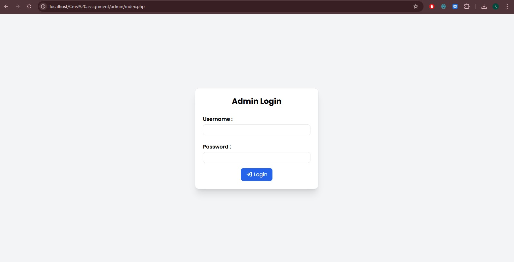
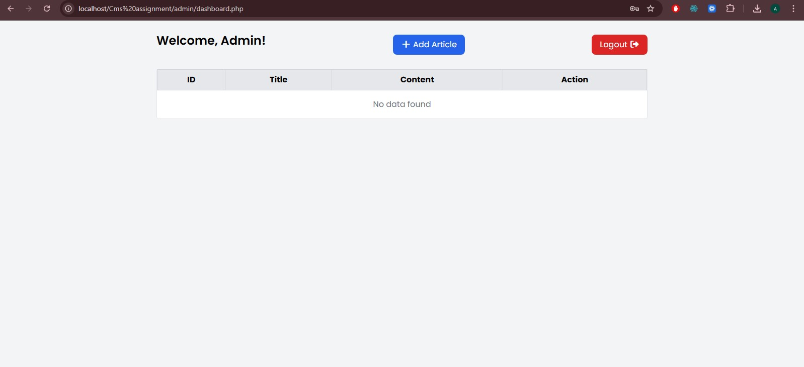
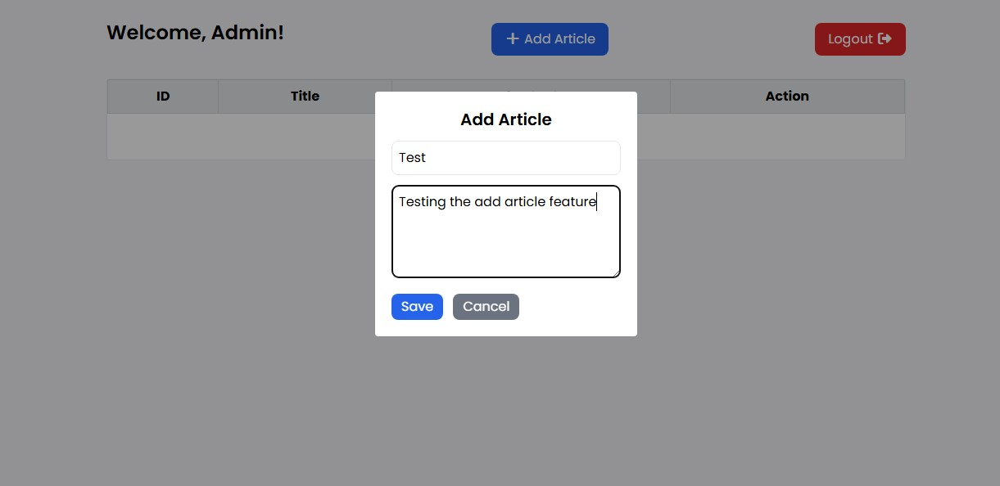
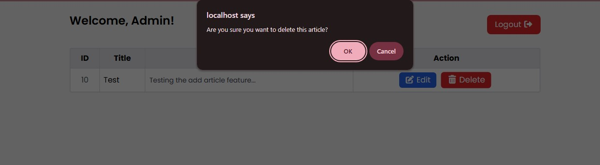
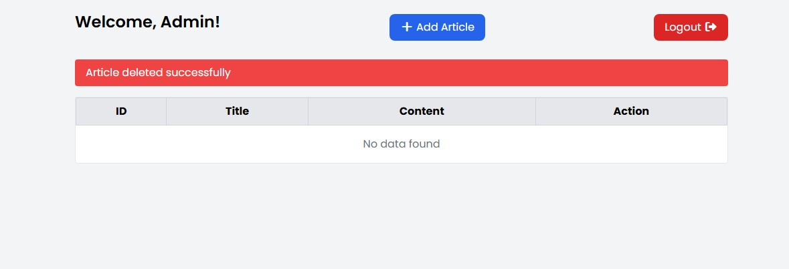
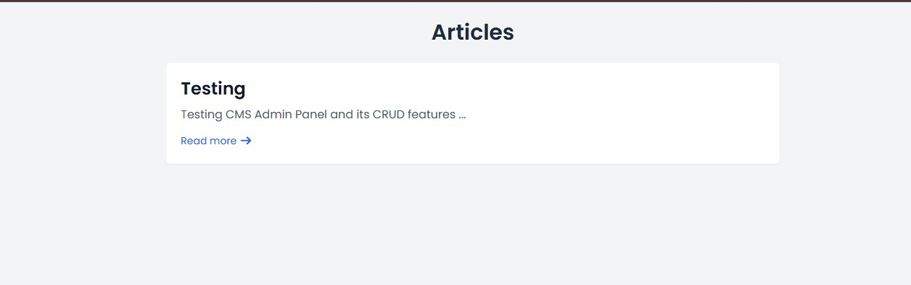
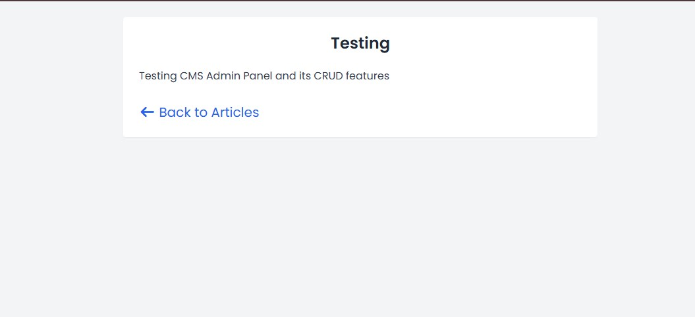

Content Management System (CMS) - Admin Panel

This project is a simple Content Management System (CMS) built using PHP, HTML, CSS, and JavaScript.
It allows an admin user to log in and manage blog articles (Create, Read, Update, Delete).

The system also includes a public view where users can view all articles and read full content.

Technologies Used:

PHP (Core PHP)

MySQL (Database)

HTML

Tailwind CSS

JavaScript

🔐 Features:

1. Authentication

Admin login using username and password.

Only logged-in users can access the admin dashboard.

Session-based authentication.

2. Admin Panel

View all articles in a table format.

Add new articles.

Edit existing articles.

Delete articles with confirmation.

Logout functionality.

3. Public View

Displays all published articles.

Clicking on an article opens the full content on a separate page.

📂 Project Structure

/project-folder
│
├── admin/
│   ├── dashboard.php (Admin Dashboard)
│   ├── delete_article.php 
│   ├── edit_article.php
│   ├── index.php (Admin Login)
│   ├── login.php
│   └── logout.php
│
├── includes/
│   ├── db.php
│
├── index.php (Public View all the Articles)
├── view_article.php (Each article opens in separate page)
│
├── database/
│   ├── cms_assignment.sql

⚙️ Setup Instructions
1. Download / Clone Project

Extract the ZIP or clone the repository into your local server directory
(inside htdocs for XAMPP).

2. Create Database

Open phpMyAdmin

Create a database named as cms_assignment

Import the provided database.sql file

3. Configure Database Connection

Open:

includes/db.php

Update database as per your credentials:

4. Run the Project

Open browser and go to:

http://localhost/CMS Assignment/

5. Admin Login Url + Credentials
Url: http://localhost/CMS Assignment/admin
Username: admin
Password: 1234

Use the given admin credentials to log in to admin dashboard

Thank you for the opportunity.
I look forward to your feedback.

🔹 Author

Ankush Prasad

## 📸 Screenshots

### 🔐 Login Page

### 📊 Admin Dashboard

### ✏️ Add Article

### ✏️ Edit Article

### ✏️ Delete Article

### ✏️ Success Error Messages

### 📄 Publicly Article List

### 📖 View Article Separately

